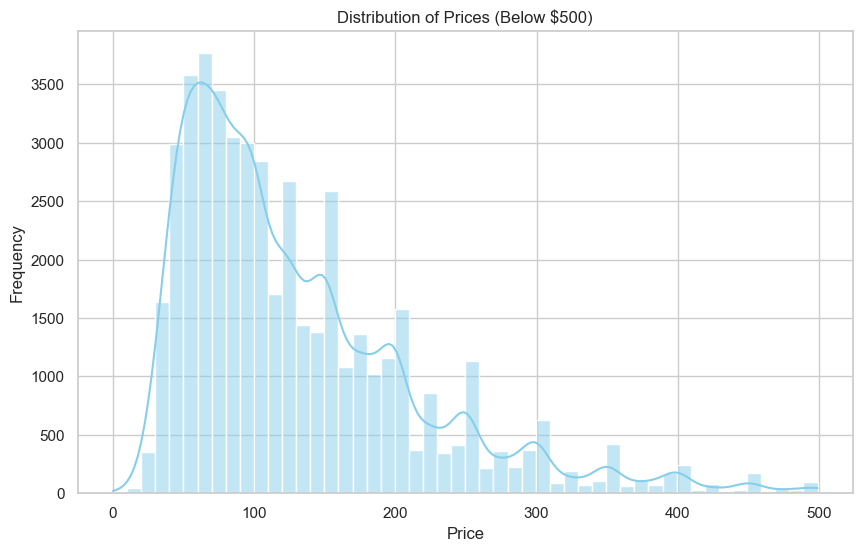
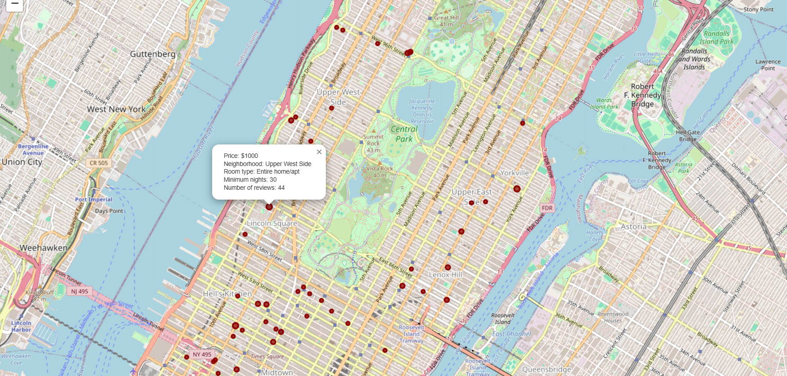

# NYC Airbnb Analysis Project

## Overview
This project analyzes Airbnb listings in New York City for the year 2019. Using various data exploration and visualization techniques, it reveals insights about listing distribution, pricing, and guest engagement across neighborhoods.

## Key Findings
- Listings are heavily concentrated in neighborhoods like Williamsburg and Bedford-Stuyvesant.
- The majority of listings are priced under $250 per night, with a small segment categorized as ultra-luxury ($800+).
- Entire Home/Apartments dominate the room types, followed by Private and Shared rooms.
- Ultra-luxury listings cluster in specific areas and have high review counts, indicating strong demand despite premium prices.

## Visualizations
- Distribution charts for prices and room types.
- Interactive maps showing listing locations, color-coded by price ranges.
- A focused map highlighting ultra-luxury listings with radius scaled by number of reviews

### Price Distribution

### NYC Airbnb UltraLux

## Data Cleaning & Preparation
- Missing values in some columns were handled thoughtfully to maintain dataset integrity.
- Extreme price outliers were identified but not removed due to their small proportion and real-world relevance.

## Future Directions
- Add time-series analysis to capture seasonal trends.
- Implement filters on the interactive map for room type, price range, and availability.
- Build predictive models for pricing based on various features.
- Analyze guest reviews for sentiment insights.

## How to Use
1. Clone the repo:  
   `git clone https://github.com/tepegozersin/nyc-2019-airbnb-analysis.git`

2. Install dependencies:  
   `pip install -r requirements.txt`

3. Run the notebook:  
   `jupyter notebook notebooks/nyc_airbnb_analysis.ipynb`

---
## Author

**Ersin Tepegöz**  
Location: Antalya, Turkey  
Email: tepegozersin@gmail.com  
LinkedIn: [linkedin.com/in/ersintepegoz](https://www.linkedin.com/in/ersin-tepeg%C3%B6z-8710ab366/)  

